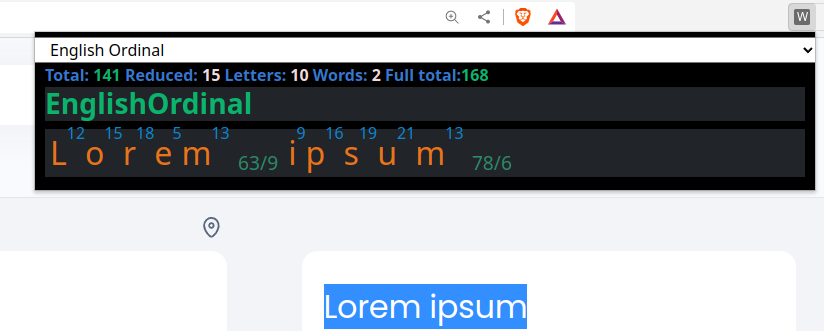
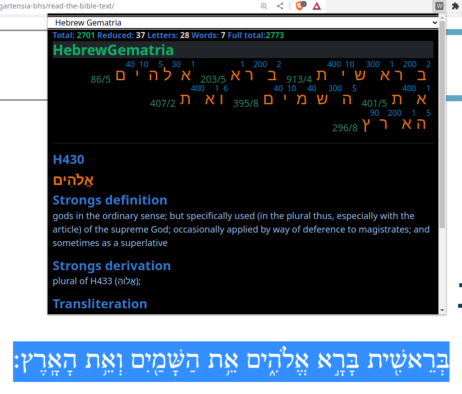
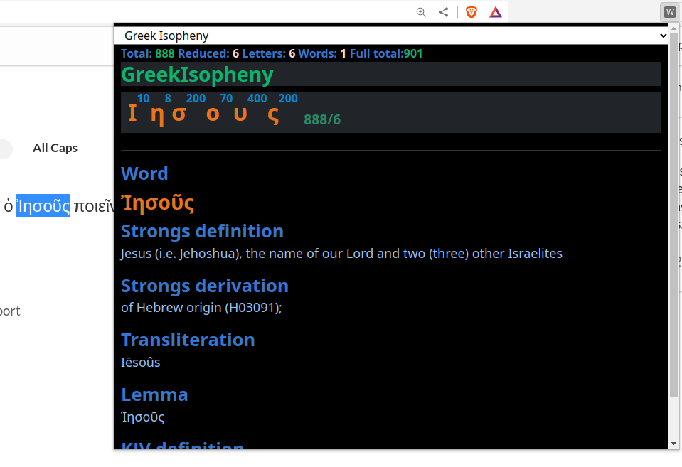

# webdecode

## a chrome Gematria extension 

### About

A gematria tool which can be used to decode language into numbers by using ciphers where 
the letters of the alphabet are connected to numerical values. The most simple cipher in the 
English alphabet would be: A=1, B=2, C=3......Z=26. This cipher is called 'English Ordinal' and is 
included in the extension. A full list of available ciphers is listed below. 

### Basic use

(optional)
Start the extension without anything selected and change the default cipher to the one needed. (when the 
cipher is changed, it will store it in the local storage of the user in the browser).

Select text on any website you wish to decode and start the extension. A popup will show the selected text with 
the value of each decoded letter displayed as well as the values for the number of letter, words, the reduced 
value and the sum of those all. 

### Hebrew Genatria

Currently two Hebrew ciphers are implemented: Standard and ordinal. The Hebrew ciphers are connected to Strong's 
concordance dictionary. In case words are found in Strong's, the data will be shown below the decoding panel.

### Greek Gematria

Currently only Greek Isopheny is implemented. This cipher is connected to Strong's Greek concordance and will display
 relevant data under the decoding panel.

### Permissions

- Storage: permissions to save the active cipher.
- Scripting: to get the currently selected text
- Active tab: to get the selected text from

chrome tab 

### Ciphers
**Traditional ciphers**
- Hebrew Gematria
- Hebrew Gematria Ordinal
- Greek Isopheny

**English Gematria & Ordinal**
- English Gematria (aka "Sumerian")
- English Gematria Reversed
- English Extended Gematria
- English Ordinal
- English Ordinal Full reduction
- English Ordinal reversed
- English Ordinal reversed full reduction
- English Ordinal Single Reduction
- English Ordinal Single Reduction Reversed
- Satanic
- Satanic (Red.)
- Satanic (Rev.)
- Satanic (Rev.Red.)
- Full Reduction Kv 

**English alternate ciphers**
- Chaldean
- Septinary
- English Extended
- English 0-26
- (ALW)Kabbalah
- (KFW)Kabbalah
- (LCH)Kabbalah

**Ciphers based on number types & properties**
- Composite numbers
- Three based
- Seven based
- Fibonacci
- Primes
- Primes Reversed
- Hexagonals
- Squares
- SquaresReversed
- Trigonal
- Trigonal Reversed 

**Unsorted ciphers**
- Francis Bacon
- Francis Baconis
- Jewish
- Jewish Gematria
- Jewish Ordinal
- Jewish reduction
- Manly P Hall Cipher
- Manly P Hall Cipher (Red.)
- Manly P Hall Cipher (Rev.)
- Manly P Hall Cipher (Red. Rev.)
